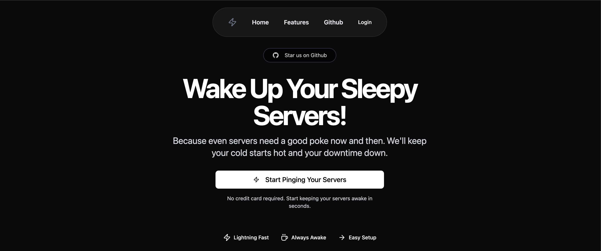

# 

# PulsePing

PulsePing is a full-stack application that monitors your servers and notifies you when they go down. It features a modern Next.js frontend and a robust Go backend, supporting Google authentication, real-time health checks, and email notifications.

---

## Features

- **Google OAuth Authentication**  
  Secure login using Google accounts.

- **Server Health Monitoring**  
  Add URLs to monitor. PulsePing pings your servers every 5 minutes.

- **Automatic Notifications**  
  Get notified via email (powered by Resend) when your server fails consecutive health checks.

- **Dashboard**  
  View all monitored tasks, logs, and manage them easily.

- **Responsive UI**  
  Built with Next.js, Tailwind CSS, and shadcn/ui for a sleek experience.

---

## Tech Stack

- **Frontend:** Next.js, React, Tailwind CSS, shadcn/ui, React Query, Next Auth, Zod
- **Backend:** Go, Gin, GORM, PostgreSQL, Redis, Resend (email)
- **Other:** Google OAuth, JWT, Docker (optional)

---

## Getting Started

### Prerequisites

- Node.js (v18+)
- Go (v1.24+)
- PostgreSQL
- Redis
- Resend API Key (for email notifications)
- Google OAuth credentials

---

### 1. Clone the Repository

```sh
git clone https://github.com/Avik-creator/pulsePing.git
```

---

### 2. Backend Setup

1. **Configure Environment Variables:**  
   Create a `.env` file in `pulse-backend/`:

   ```
   DATABASE_URL=your_postgres_url
   JWT_SECRET=your_jwt_secret
   RESEND_API_KEY=your_resend_api_key
   REDIS_URL=your_redis_url
   PORT=8000
   ```

2. **Install Go Dependencies:**

   ```sh
   cd pulse-backend
   go mod tidy
   ```

3. **Run the Backend:**

   ```sh
   go run main.go
   ```

---

### 3. Frontend Setup

1. **Configure Environment Variables:**  
   Create a `.env` file in `pulse-frontend/`:

   ```
   GOOGLE_CLIENT_ID=your_google_client_id
   GOOGLE_CLIENT_SECRET=your_google_client_secret
   NEXTAUTH_SECRET=your_nextauth_secret
   BACKEND_URL=http://localhost:8000
   ```

2. **Install Node Dependencies:**

   ```sh
   cd pulse-frontend
   npm install
   ```

3. **Run the Frontend:**

   ```sh
   npm run dev
   ```

   Open [http://localhost:3000](http://localhost:3000) in your browser.

---

## Usage

- **Sign in** with Google.
- **Add a server URL** to monitor.
- **View logs** and status on your dashboard.
- **Receive email notifications** if your server goes down.

---

## Project Structure

```
pulse-backend/
  main.go
  Database/
  Models/
  Routes/
  handlers/
  libraries/
  Middlewares/
  Workers/
pulse-frontend/
  src/
    app/
    components/
    lib/
    types/
    actions/
  public/
  ...
```

---

## Contributing

Pull requests are welcome! For major changes, please open an issue first to discuss what you would like to change.

---

## Author

- [Avik Mukherjee](https://github.com/Avik-creator)

---

## Links

- [Live Demo](https://pulseping.avikmukherjee.me)
